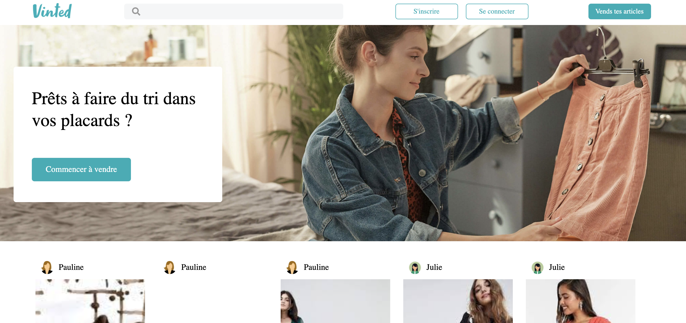

# 👗 VINTED

**Fancying a little shopping ?** Here is a duplicate of Vinted where you can browse offers, add them to cart and pay with Stripe.

**Fullstack project**

👉 Netlify Link to see the live version [HERE](https://vinted-duplicate-pb.netlify.app/)  
👉 Repo for the Backend of this project [HERE](https://github.com/Pauline-Bouchereau/vinted-duplicate)



_Made in 2021 @ Le Reacteur_

### ⚙️ Main functionalities :

Login/Sign Up || Add a product to cart || Payment with Stripe || Pagination

### 🔧 Stack

✔️ JavaScript
✔️ React.Js
✔️ HTML 5
✔️ CSS 3

### 🪛 Packages

✔️ Axios  
✔️ React Router Dom  
✔️ Js-Cookies  
✔️ "@fortawesome/fontawesome-svg-core": "^1.2.35"  
✔️ "@fortawesome/free-regular-svg-icons": "^5.15.3"  
✔️ "@fortawesome/free-solid-svg-icons": "^5.15.3"  
✔️ "@fortawesome/react-fontawesome": "^0.1.14".

### 🚀 Running the project

#### Clone this repository :

```javascript
git clone https://github.com/Pauline-Bouchereau/vinted-duplicate-front
cd vinted-duplicate-front
```

#### Install packages :

```javascript
yarn
```

#### When installation is complete :

```javascript
yarn start
```
